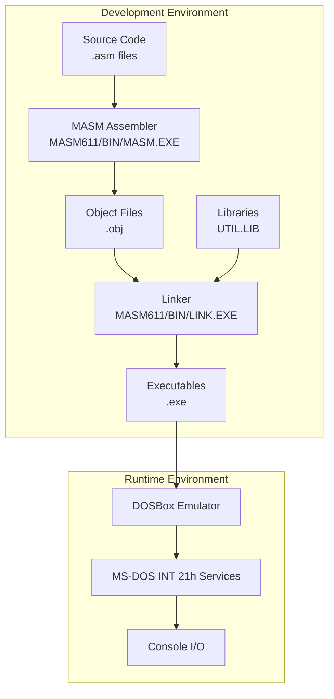
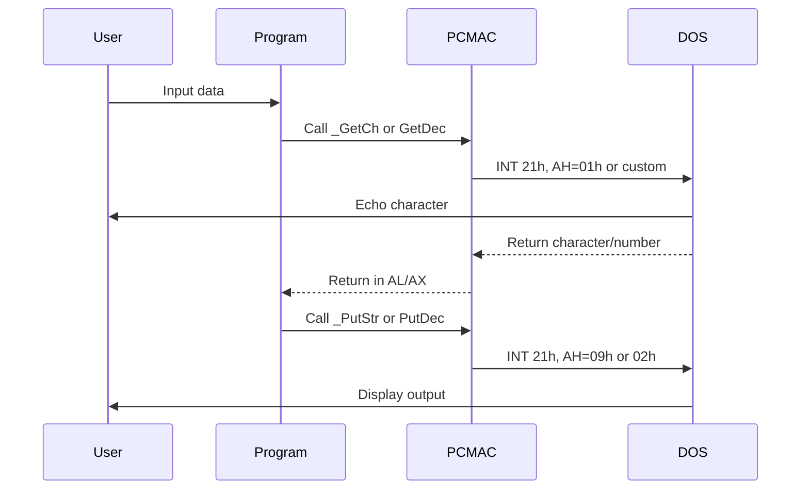
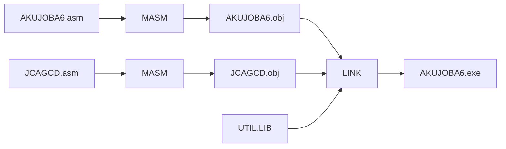

# Architecture Overview

This document provides a comprehensive overview of the DOSBOX repository architecture, including the assembly program structure, MASM toolkit organization, and common patterns used throughout the codebase.

## Table of Contents

- [System Overview](#system-overview)
- [Component Architecture](#component-architecture)
- [Assembly Program Structure](#assembly-program-structure)
- [Memory Model](#memory-model)
- [Data Flow](#data-flow)
- [Module Descriptions](#module-descriptions)
- [Common Patterns](#common-patterns)

## System Overview



### Technology Stack

- **Assembler**: Microsoft MASM 6.11 (1993)
- **Target Platform**: MS-DOS, 16-bit real mode
- **Architecture**: x86 (Intel 586 instruction set)
- **Memory Model**: Small (code and data each < 64KB)
- **Runtime**: DOSBox DOS emulator

## Component Architecture

### 1. MASM611 Toolkit

Complete Microsoft Macro Assembler Professional Development System:

```
MASM611/
├── BIN/              # Development executables
│   ├── MASM.EXE     # Macro Assembler 6.11
│   ├── ML.EXE       # Macro Assembler (alternative interface)
│   ├── LINK.EXE     # Object linker
│   ├── LIB.EXE      # Library manager
│   ├── CV.EXE       # CodeView debugger
│   ├── NMAKE.EXE    # Make utility
│   └── ...          # Additional tools
├── INCLUDE/          # Standard include files
│   ├── DOS.INC      # DOS structure definitions
│   ├── BIOS.INC     # BIOS service definitions
│   └── MACROS.INC   # Standard macros
└── HELP/            # Online help files
```

**Key Tools:**
- **MASM.EXE**: Assembles .asm source to .obj object files
- **LINK.EXE**: Links .obj files and libraries to .exe executables
- **CV.EXE**: Source-level debugger with breakpoints and watches
- **LIB.EXE**: Creates and manages .lib libraries

### 2. Program Structure

```
Programs/
├── PCMAC.INC        # Shared macro library (William B. Jones)
├── UTIL.LIB         # Utility library (I/O procedures)
├── TEMPLATE/        # Reusable program template
├── FIRST/           # Basic example
├── AKUJOBIA3/       # Assignment 3
├── AKUJOBA4/        # Assignment 4
├── AKUJOBA5/        # Assignment 5
├── AKUJOBA6/        # Assignment 6 (multi-file)
└── AKUJOBA7/        # Assignment 7
```

### 3. Shared Components

#### PCMAC.INC - Macro Library

High-level macros that simplify DOS programming:

| Macro | Purpose | Underlying Mechanism |
|-------|---------|---------------------|
| `_Begin` | Initialize data segment | Sets DS to @data, adjusts stack |
| `_Exit` | Exit to DOS | INT 21h, AH=4Ch |
| `_PutStr` | Display string | INT 21h, AH=09h |
| `_GetCh` | Read character | INT 21h, AH=01h |
| `_PutCh` | Write character | INT 21h, AH=02h |

#### UTIL.LIB - I/O Library

Pre-compiled procedures for decimal I/O:

| Procedure | Signature | Function |
|-----------|-----------|----------|
| `GetDec` | Input: none<br/>Output: AX | Read decimal number from keyboard |
| `PutDec` | Input: AX<br/>Output: none | Display decimal number to screen |

## Assembly Program Structure

### Standard Program Template

```assembly
;; ============================================================================
;; HEADER COMMENT BLOCK
;; Name:        [Student Name]
;; Class:       CSC 314
;; Assign:      Assignment #
;; Due:         [Date]
;; Description: [What the program does]
;; ============================================================================

include pcmac.inc          ; Include macro library

.model small               ; Memory model declaration
.586                       ; Target processor (Intel 586/Pentium)
.stack 100h                ; Stack size (256 bytes)

;; ============================================================================
;; DATA SEGMENT
;; ============================================================================
.data
    ; Variables and constants here
    message db "Hello, World!", '$'    ; Strings end with '$'
    number dw 0                        ; Word variable (16-bit)
    buffer db 80 dup(?)                ; Array of 80 bytes

;; ============================================================================
;; CODE SEGMENT
;; ============================================================================
.code

; External procedure declarations
extrn GetDec:near          ; From UTIL.LIB
extrn PutDec:near          ; From UTIL.LIB

;; ----------------------------------------------------------------------------
;; Main Procedure
;; ----------------------------------------------------------------------------
main proc
    _Begin                 ; Initialize data segment
    
    ; Program logic here
    _PutStr message       ; Display message
    call GetDec           ; Read number into AX
    call PutDec           ; Display number from AX
    
    _Exit 0               ; Return to DOS with exit code 0
main endp

;; ----------------------------------------------------------------------------
;; Additional Procedures
;; ----------------------------------------------------------------------------
helper proc
    ; Procedure logic
    ret
helper endp

end main                  ; Entry point
```

### Segment Organization

1. **Header**: Comment block with metadata
2. **Includes**: External macro/include files
3. **Directives**: Model, processor, stack size
4. **Data Segment**: Variables and constants
5. **Code Segment**: Procedures and logic
6. **Entry Point**: `end main` directive

## Memory Model

### Small Memory Model (.model small)

- **Code Segment**: Single 64KB segment for all code
- **Data Segment**: Single 64KB segment for all data
- **Stack Segment**: Separate segment (typically 256 bytes)
- **Near Calls**: All procedure calls are near (within same segment)
- **Near Data**: All data references are near (within same segment)

### Memory Map

```
+-------------------+  FFFF:FFFF
|   BIOS & Video    |
+-------------------+  A000:0000
|                   |
|   Free Memory     |
|                   |
+-------------------+
|   Stack Segment   |  256 bytes
+-------------------+
|   Data Segment    |  < 64KB
+-------------------+
|   Code Segment    |  < 64KB
+-------------------+
|   PSP (DOS)       |  256 bytes
+-------------------+  0000:0000
```

### Register Usage Conventions

| Register | Common Usage | Preserved? |
|----------|--------------|------------|
| AX | Accumulator, function return value | No |
| BX | Base register, addressing | No |
| CX | Counter (loops) | No |
| DX | Data register, I/O operations | No |
| SI | Source index (string ops) | Yes* |
| DI | Destination index (string ops) | Yes* |
| BP | Base pointer (stack frames) | Yes |
| SP | Stack pointer | Yes |
| DS | Data segment | Yes |
| ES | Extra segment | No |
| SS | Stack segment | Yes |
| CS | Code segment | Yes |

*Preserved by procedures if used

## Data Flow

### Input/Output Flow



### Multi-File Compilation Flow

Example: AKUJOBA6 (GCD Calculator)



**Commands:**
```bash
MASM AKUJOBA6.asm
MASM JCAGCD.asm
LINK AKUJOBA6.obj JCAGCD.obj,,,UTIL
```

## Module Descriptions

### Core Programs

#### FIRST (Basic Example)
- **Purpose**: Minimal "Hello World" demonstrating basic structure
- **Key Features**: String output, DOS interrupt
- **Complexity**: ~22 lines
- **Dependencies**: None (uses direct INT 21h)

#### TEMPLATE (Reusable Skeleton)
- **Purpose**: Starting point for new programs
- **Key Features**: Complete structure with placeholders
- **Includes**: PCMAC.INC macros
- **Dependencies**: PCMAC.INC, UTIL.LIB

### Assignment Programs

#### AKUJOBIA3 (Date Display)
- **Algorithm**: Call DOS date service, format output
- **DOS Services**: INT 21h, AH=2Ah (Get Date)
- **I/O**: PutDec for numeric display
- **Complexity**: ~89 lines

#### AKUJOBA4 (Temperature Conversion)
- **Algorithm**: F = (C × 9/5) + 32
- **Features**: Arithmetic operations, signed integers
- **I/O**: GetDec (input), PutDec (output)
- **Complexity**: ~98 lines

#### AKUJOBA5 (Character Animation)
- **Algorithm**: Loop-based character movement
- **Features**: Delays, screen positioning, input validation
- **I/O**: GetDec, _PutCh, cursor control
- **Complexity**: ~175 lines

#### AKUJOBA6 (GCD Calculator)
- **Algorithm**: Euclidean algorithm (recursive)
- **Architecture**: Multi-file (main + procedure module)
- **Files**: AKUJOBA6.asm (main), JCAGCD.asm (GCD procedure)
- **Complexity**: 130 + 139 lines

#### AKUJOBA7 (Name Formatter)
- **Algorithm**: String parsing, reverse search
- **Features**: Array manipulation, multi-word parsing
- **Input Format**: "FirstName MiddleName LastName"
- **Output Format**: "LastName, FirstName MiddleName"
- **Complexity**: ~408 lines (most complex)

## Common Patterns

### Pattern 1: Input Validation Loop

```assembly
getInput:
    _PutStr prompt
    call GetDec              ; Get number
    cmp ax, MIN_VALUE
    jl invalid               ; Jump if less than minimum
    cmp ax, MAX_VALUE
    jg invalid               ; Jump if greater than maximum
    mov variable, ax         ; Store valid input
    ret
invalid:
    _PutStr errorMsg
    jmp getInput             ; Retry
```

### Pattern 2: Procedure with Register Preservation

```assembly
myProc proc
    push ax                  ; Save registers
    push bx
    push cx
    
    ; Procedure logic
    
    pop cx                   ; Restore in reverse order
    pop bx
    pop ax
    ret
myProc endp
```

### Pattern 3: String Manipulation

```assembly
; Find last space in string
mov si, offset nameArray + namelen - 1  ; Start at end
mov cx, namelen                         ; Counter
findSpace:
    cmp byte ptr [si], ' '              ; Check for space
    je found                             ; Jump if found
    dec si                               ; Move backward
    loop findSpace                       ; Repeat
found:
    ; SI now points to last space
```

### Pattern 4: DOS Interrupt Call

```assembly
; Direct INT 21h call (alternative to macros)
mov ah, 09h              ; Function 09h: Display string
mov dx, offset message   ; DS:DX points to string
int 21h                  ; Call DOS
```

### Pattern 5: External Procedure Declaration and Use

```assembly
; In main file
.code
extrn HelperProc:near    ; Declare external procedure

main proc
    ; ...
    call HelperProc      ; Call external procedure
    ; ...
main endp

; In helper file
.code
public HelperProc        ; Make procedure visible

HelperProc proc
    ; Implementation
    ret
HelperProc endp
```

## Build and Link Process

### Single-File Program

```
Source Code (*.asm)
    ↓
[MASM Assembler]
    ↓
Object File (*.obj)
    ↓
[LINK Linker] + UTIL.LIB
    ↓
Executable (*.exe)
```

### Multi-File Program

```
File1.asm    File2.asm
    ↓            ↓
[MASM]       [MASM]
    ↓            ↓
File1.obj    File2.obj
    ↓            ↓
    └────┬───────┘
         ↓
    [LINK] + UTIL.LIB
         ↓
    Program.exe
```

### Linker Map File

The linker produces a .MAP file showing:
- Segment addresses
- Public symbols
- Entry point
- Memory usage

Example (AKUJOBA4.MAP):
```
Start  Stop   Length Name                   Class
00000H 00101H 00102H _TEXT                  CODE
00110H 0016FH 00060H _DATA                  DATA
00170H 0026FH 00100H STACK                  STACK
```

## Performance Considerations

### Optimization Techniques Used

1. **Register Usage**: Keep frequently-used values in registers
2. **Loop Unrolling**: Some delay loops use NOPs
3. **Minimal Stack Usage**: Only preserve necessary registers
4. **Direct Addressing**: Use offsets when possible

### Limitations

- **16-bit Arithmetic**: Max integer value 65,535 (unsigned) or ±32,767 (signed)
- **Memory Constraints**: 64KB code, 64KB data per segment
- **Real Mode**: No memory protection or virtual memory
- **Single-Threaded**: No concurrency support

## Security Considerations

### Input Validation

Programs implement basic validation:
- Range checking (e.g., AKUJOBA5: trips must be 1-3)
- Buffer overflow protection (e.g., AKUJOBA7: 80-character limit)

### Limitations

- **No ASLR**: Fixed memory layout in DOS
- **No DEP**: Code and data in writable segments
- **No Stack Protection**: No canaries or guards
- **Direct Hardware Access**: Minimal OS security

*Note: These programs are educational and run in isolated DOSBox environment.*

## Future Enhancements

Potential improvements (beyond current scope):
- [ ] 32-bit protected mode versions
- [ ] Modern assembler ports (NASM/FASM)
- [ ] Graphics mode examples
- [ ] Mouse input support
- [ ] File I/O demonstrations
- [ ] Floating-point arithmetic (8087 coprocessor)

---

For development workflow details, see [DEVELOPMENT.md](DEVELOPMENT.md).
